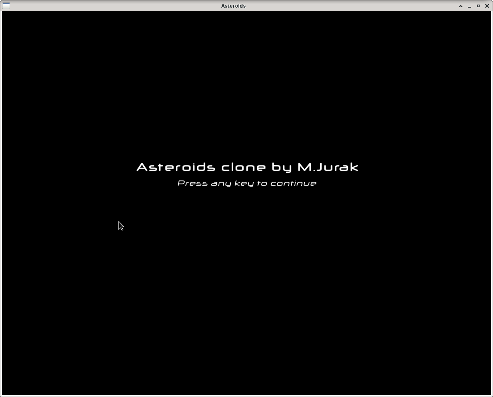
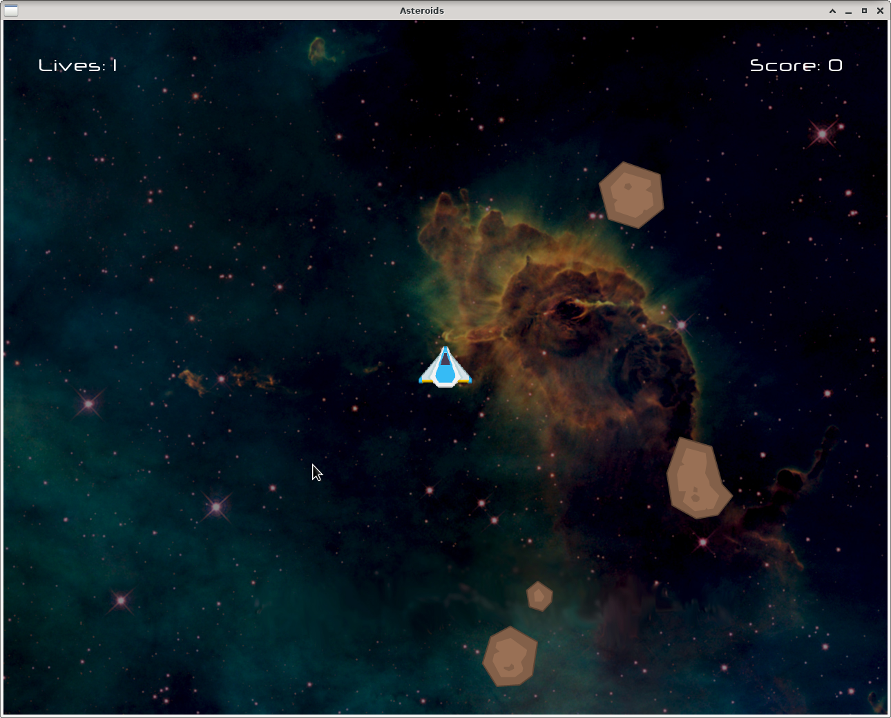
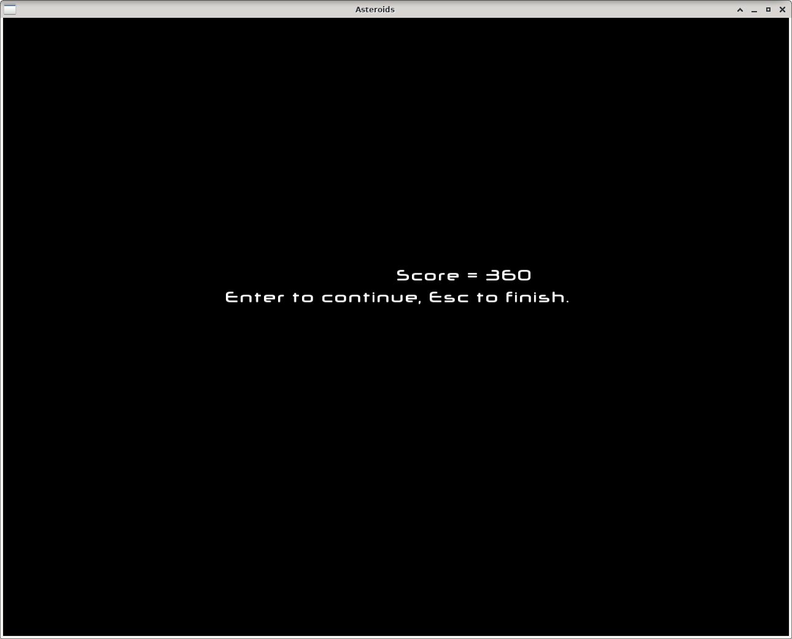
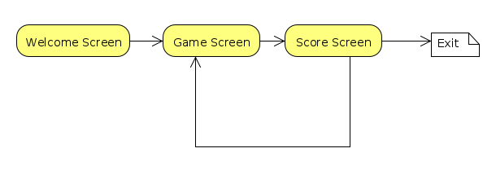
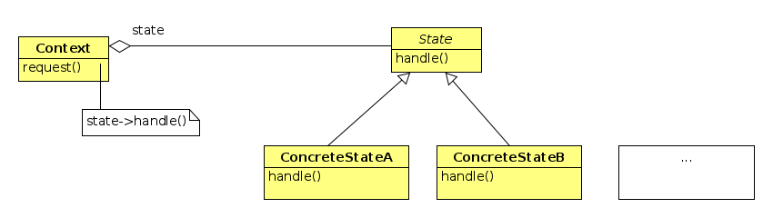
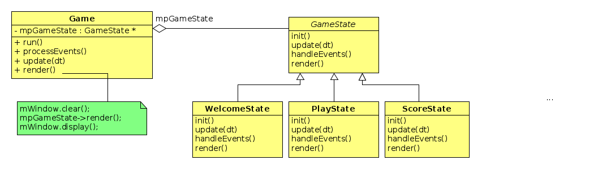

# Asteroids sa _stanjima_
Igra započinje pozdravnim ekranom. Na primjer:

Nakon što se pritisne bilo koja tipka počinje igra.
Igrač dobiva ekran igre:

Kada igra završi ispisuje se rezultat (broj bodova) i način nastavka i završetka 
igre.

## Konačni automat

Vidmo da naša aplikacija ima niz stanja u kojima se ponaša na različite
načine. U igri mora reagirati na strelice i razmaknicu, u ostalim stanjima reagira
 na  `Return` i `Escape` ili na bilo koju tipku. Svako stanje radi drukčije
 iscrtavanje. Iz jednog stanja se može prijeći u  drugo stanje
 prema _pravilima igre_. Takva se struktura naziva _konačni automat_
 i u našem slučaju je vrlo jednostavna i može se prikazati na ovaj način:

 

## _State_ oblikovni obrazac

Umjesto da implementiramo logiku različitih stanja u jednoj velikoj if
naredbi stavit ćemo logiku svakog pojedinog stanja u zasebnu klasu. Time dobivamo
sljedeću strukturu:

 

 

# Asteroids-copy
